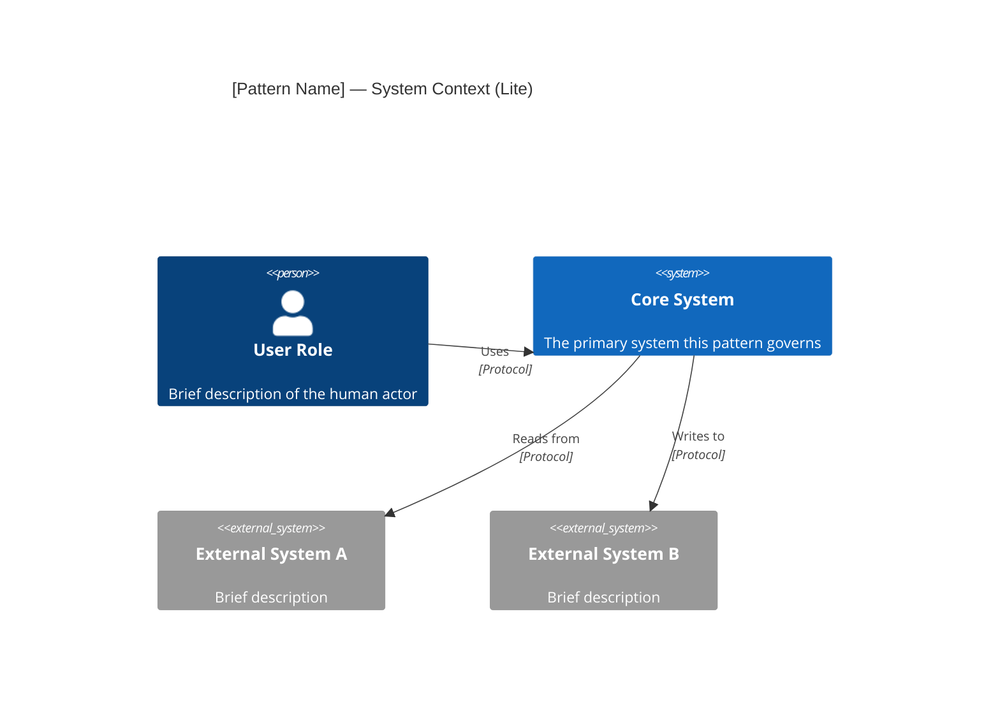
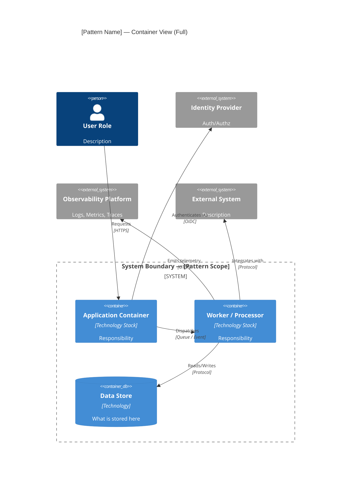
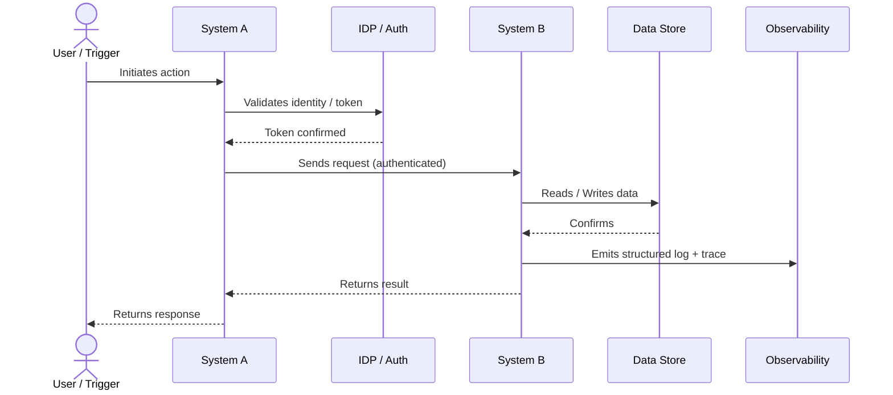

# [Pattern Name] — Architectural Design Pattern

> **RFC 2119 Notice:** The key words **MUST**, **MUST NOT**, **REQUIRED**, **SHALL**, **SHALL NOT**, **SHOULD**, **SHOULD NOT**, **RECOMMENDED**, **MAY**, and **OPTIONAL** in this document are to be interpreted as described in [RFC 2119](https://www.rfc-editor.org/rfc/rfc2119).

---

## 1. Pattern Identity

| Field | Value |
|---|---|
| **Pattern ID** | `ADP-000` |
| **Name** | Pattern Name |
| **Version** | `0.1.0` |
| **Status** | `draft` |
| **Lifecycle Stage** | `experimental` |
| **Pattern Type** | `enterprise` / `solution` / `composite` |
| **Domain** | _(e.g., data-movement, identity, integration, security, compute)_ |
| **Owner** | Name / Team |
| **Reviewers** | Names |
| **Created** | YYYY-MM-DD |
| **Last Reviewed** | YYYY-MM-DD |
| **Next Review Due** | YYYY-MM-DD |

### 1.1 Status Definitions

| Status | Meaning |
|---|---|
| `draft` | Under initial authorship; not yet submitted for review |
| `under-review` | Active architecture review session in progress |
| `approved` | Ratified for use across the portfolio |
| `conditionally-approved` | Approved with documented constraints or time-boxed exceptions |
| `deprecated` | Superseded by a newer pattern; existing instances may remain until migration deadline |
| `retired` | No new instances permitted; existing instances **MUST** migrate by stated deadline |

### 1.2 Lifecycle Stage Definitions

> Lifecycle stage maps to the Technology Radar governance model and controls which ALM phases the pattern may be used in.

| Stage | Meaning | ALM Phases Permitted |
|---|---|---|
| `experimental` | Proof-of-concept; limited portfolio use only | Inception, Design |
| `incubating` | Active pilots underway; not yet broadly recommended | Inception, Design, Build |
| `adopted` | Default recommended approach for this domain | All phases |
| `hold` | No new usage; existing instances being managed to retirement | Operate, Retire |

---

## 2. Pattern Relationships

> Patterns are composable. When this pattern is used within a composite pattern, any optionality defined here **MUST** be resolved to a concrete, documented choice in the composing pattern. Unresolved optionality in a composition is a validation error.

### 2.1 Extends

> This pattern specializes or inherits from the following patterns. All constraints from parent patterns remain in force unless explicitly overridden here.

| Pattern ID | Pattern Name | What Is Specialized / Overridden |
|---|---|---|
| ADP-000 | _Base Pattern Name_ | _Description of specialization_ |

### 2.2 Requires

> These patterns **MUST** be deployed and compliant before or alongside this pattern. A system implementing this pattern without its required patterns is non-compliant.

| Pattern ID | Pattern Name | Requirement Rationale |
|---|---|---|
| ADP-000 | _Required Pattern Name_ | _Why this dependency exists_ |

### 2.3 Composed Of

> This composite pattern assembles the following component patterns. Options that were open in the component pattern **MUST** be resolved here.

| Pattern ID | Pattern Name | Role in This Composition | Options Resolved |
|---|---|---|---|
| ADP-000 | _Component Pattern_ | _Role description_ | _Option A selected because..._ |

### 2.4 Conflicts With

> These patterns are mutually exclusive with this pattern in the same system boundary.

| Pattern ID | Pattern Name | Conflict Rationale |
|---|---|---|
| ADP-000 | _Conflicting Pattern_ | _Why these cannot coexist_ |

---

## 3. Summary

> _One to two paragraphs. What problem does this pattern solve, for whom, and why is this the approved approach over alternatives? Write for an audience of architects and senior engineers who may not know your domain._

---

## 4. Context & Problem Statement

### 4.1 Context

> Describe the architectural context in which this pattern applies — what kind of system, what operational environment, what organizational constraints.

### 4.2 Problem

> What specific recurring problem does this pattern address? Frame it as a force or tension, not a solution.

### 4.3 Driving Forces

> Key forces that shaped the design of this pattern.

- **Force 1:** _(e.g., Data residency compliance requires all PII to remain within approved regions)_
- **Force 2:**
- **Force 3:**

---

## 5. Pattern Variants

> Each variant is a valid, distinct instantiation of this pattern. All variants **MUST** satisfy the REQUIRED constraints in §8. Variant-specific constraints are additive and **MUST NOT** contradict §8.

| Variant ID | Name | Status | Use When | Constraints Added |
|---|---|---|---|---|
| `VAR-01` | _Variant Name_ | `approved` | _Condition under which this variant applies_ | _Any additional constraints_ |
| `VAR-02` | _Variant Name_ | `conditionally-approved` | _Condition_ | _Exception documented in OI-XXX_ |

---

## 6. Acceptable Use Cases

> Scenarios where this pattern **SHOULD** or **MAY** be applied. Each use case **MUST** satisfy all REQUIRED constraints in §8 to be a valid instance.

| Use Case ID | Description | Applicable Variant | Additional Notes |
|---|---|---|---|
| `UC-01` | _Description_ | `VAR-01` | |
| `UC-02` | _Description_ | `VAR-01`, `VAR-02` | |

---

## 7. Unacceptable Use Cases & Anti-Patterns

> Scenarios where this pattern **MUST NOT** be applied. Each anti-pattern names an approved alternative so implementors are not left without a path forward.

| Anti-Pattern ID | Description | Why It Fails This Pattern | Approved Alternative |
|---|---|---|---|
| `AP-01` | _Description of the misuse_ | _Technical or governance rationale_ | `ADP-XXX` — _Pattern Name_ |
| `AP-02` | _Description_ | _Rationale_ | _Alternative approach_ |

---

## 8. RFC 2119 Constraints

> These constraints define what constitutes a **valid instance** of this pattern. The Drift Detection Specification in §12 derives its assertions directly from constraints marked `[C-XXX]`. Every constraint **MUST** have a corresponding drift detection assertion or a documented rationale for why automated detection is not feasible.

### 8.1 Implementation Constraints

| ID | Constraint | Level |
|---|---|---|
| `C-001` | All instances **MUST** _[constraint]_ | MUST |
| `C-002` | Instances **MUST NOT** _[constraint]_ | MUST NOT |
| `C-003` | Implementations **SHOULD** _[constraint]_ | SHOULD |
| `C-004` | Implementations **SHOULD NOT** _[constraint]_ | SHOULD NOT |
| `C-005` | Implementations **MAY** _[optional capability]_ | MAY |

### 8.2 Tool Constraints

| ID | Constraint | Level |
|---|---|---|
| `C-010` | Implementations **MUST** use an approved tool from the following set for _[role]_: `[tool-a, tool-b]` | MUST |
| `C-011` | Implementations **MUST NOT** use `[prohibited-tool]` for _[reason]_ | MUST NOT |
| `C-012` | If `[tool-a]` is used, it **MUST** be version `>= x.y` | MUST |

### 8.3 Authentication & Authorization Constraints

| ID | Constraint | Level |
|---|---|---|
| `C-020` | All service-to-service communication **MUST** use `[auth mechanism]` | MUST |
| `C-021` | Credentials **MUST NOT** be stored in `[prohibited location, e.g., source code, unencrypted config]` | MUST NOT |
| `C-022` | All human access **MUST** be granted through group membership, not direct role assignment | MUST |
| `C-023` | Service accounts **MUST** follow the least-privilege principle and **MUST NOT** be assigned roles beyond those listed in §10.3 | MUST |

### 8.4 Data Constraints

| ID | Constraint | Level |
|---|---|---|
| `C-030` | Data classified as `Restricted` **MUST NOT** leave the approved data perimeter | MUST |
| `C-031` | All data at rest **MUST** be encrypted using `[approved cipher, e.g., AES-256]` | MUST |
| `C-032` | All data in transit **MUST** use TLS 1.2 or higher | MUST |
| `C-033` | PII **MUST NOT** be logged in plaintext at any stage of the pipeline | MUST NOT |

### 8.5 Operational Constraints

| ID | Constraint | Level |
|---|---|---|
| `C-040` | All instances **MUST** emit structured logs to the approved observability platform | MUST |
| `C-041` | All instances **MUST** expose a health/liveness endpoint or equivalent status signal | MUST |
| `C-042` | Alerting **MUST** be configured for _[failure conditions]_ | MUST |

---

## 9. Tools

> All tools listed here are ratified components of the approved technology stack for this pattern. Substitution **MUST NOT** occur without an approved ADR and a version bump on this pattern document.

| Tool | Role in Pattern | Approved Version(s) | License Tier | Replaces | Notes |
|---|---|---|---|---|---|
| _Tool Name_ | _Role description_ | `>= x.y` | Enterprise / Team | _Prior tool if applicable_ | |
| _Tool Name_ | _Role description_ | `>= x.y` | Enterprise | | |

### 9.1 Tool Dependency Matrix

> Version combinations that have been tested and approved together.

| Tool A | Version | Tool B | Version | Status |
|---|---|---|---|---|
| _Tool A_ | `>= x.y` | _Tool B_ | `>= a.b` | ✅ Approved |
| _Tool A_ | `< x.y` | _Tool B_ | `>= a.b` | ❌ Not Approved — violates C-012 |

---

## 10. Authentication & Authorization

### 10.1 Identity Provider

| Attribute | Value |
|---|---|
| **IDP** | _(e.g., Okta, Azure AD, AWS IAM Identity Center)_ |
| **Protocol** | _(OIDC / SAML 2.0 / AWS SigV4)_ |
| **Token Type** | _(JWT / opaque / STS credentials)_ |
| **Token Lifetime** | |
| **Refresh / Rotation Strategy** | |

### 10.2 Service-to-Service Authentication

| Connection | Auth Mechanism | Credential Store | Rotation Frequency | Constraint Ref |
|---|---|---|---|---|
| _Service A → Service B_ | _(mTLS / OAuth2 CC / API Key)_ | _(Vault / AWS SSM / Azure KV)_ | _(e.g., 90 days)_ | `C-020` |

### 10.3 RBAC Roles

> The roles defined here are the **minimum required** for a valid instance of this pattern. Additional roles **MAY** be defined by implementing teams but **MUST NOT** grant permissions beyond those listed here to any role that maps to the roles below.

| Role ID | Role Name | Permissions | Scope | Human / Service | Notes |
|---|---|---|---|---|---|
| `R-001` | _Pattern Admin_ | Read, Write, Execute, Manage | _Resource scope_ | Human only | |
| `R-002` | _Pattern Operator_ | Read, Write, Execute | _Resource scope_ | Human / Service | |
| `R-003` | _Pattern Reader_ | Read | _Resource scope_ | Human / Service | Audit role |
| `R-004` | _Pipeline Service Account_ | _(scoped permissions)_ | _Specific resources only_ | Service only | Must not hold R-001 per C-022 |

### 10.4 Authorization Constraints

- **[C-023]** The Pipeline Service Account role (`R-004`) **MUST NOT** be assigned administrative permissions.
- **[C-024]** Human roles **MUST** be assigned through an IDP group, not directly to individual identities.
- **[C-025]** Role assignments **MUST** be reviewed on a cadence no longer than 90 days.

---

## 11. Integration Points

> Integration points define the pattern's boundaries with external systems. An implementation that introduces an undocumented integration point is non-compliant and **MUST** trigger a pattern review.

| Integration ID | System | Direction | Protocol | Auth Method | Data Classification | SLA | Notes |
|---|---|---|---|---|---|---|---|
| `INT-001` | _System Name_ | Inbound | _(REST / gRPC / Event / Batch)_ | _(OAuth2 / mTLS)_ | _(Internal / Confidential)_ | _(e.g., 99.9%)_ | |
| `INT-002` | _System Name_ | Outbound | | | | | |
| `INT-003` | _System Name_ | Bidirectional | | | | | |

### 11.1 Integration Constraints

| ID | Constraint | Level |
|---|---|---|
| `C-070` | All inbound integrations **MUST** validate payload schema at the boundary | MUST |
| `C-071` | Outbound integrations **MUST NOT** transmit `Restricted` data to systems not approved for that classification | MUST NOT |
| `C-072` | New integration points **MUST NOT** be introduced without updating this document and re-triggering architecture review | MUST NOT |

---

## 12. Data Flow

### 12.1 Flow Description

> Prose narrative of data movement through this pattern: source systems, transformation stages, persistence points, and egress boundaries. Write this so an auditor or new team member can follow the data end-to-end.

### 12.2 Data Classification Inventory

| Data Element | Classification | Handling Requirement | Constraint Ref |
|---|---|---|---|
| _Element Name_ | `Public` / `Internal` / `Confidential` / `Restricted` | _Requirement_ | `C-030` |

### 12.3 Data Flow Constraints

> See §8.4 for full data constraints. Key constraints are repeated here for traceability.

- **[C-030]** Data classified as `Restricted` **MUST NOT** leave the approved data perimeter.
- **[C-031]** All data at rest **MUST** be encrypted.
- **[C-032]** All data in transit **MUST** use TLS 1.2+.
- **[C-033]** PII **MUST NOT** appear in plaintext logs.

---

## 13. Architecture Diagrams

> Diagrams **MUST** be kept in sync with the pattern version. A diagram that contradicts the prose is a documentation defect and **MUST** be resolved before the pattern can be marked `approved`.

### 13.1 Lite View — System Context (C4 Level 1)

> Use for: executive summaries, pattern catalogue entries, onboarding documentation.



### 13.2 Full View — Container Diagram (C4 Level 2)

> Use for: architecture review sessions, implementation handoffs, drift detection mapping.



### 13.3 Data Flow Sequence

> Use for: reviewing data movement order, identifying failure modes, audit trail analysis.



---

## 14. Application Lifecycle Integration

> This section governs how this pattern intersects with the Application Lifecycle Management (ALM) process across the portfolio.

| ALM Stage | Pattern Applicability | Required Actions | Gate Owner |
|---|---|---|---|
| **Inception** | Assessment | Evaluate pattern fit; document selected variant in solution brief | EA Team |
| **Design** | Required reference | Pattern ID **MUST** be cited in the solution design document | Solution Architect |
| **Build** | Validation gate | CI linter validates pattern compliance before merge to main | Automated + EA |
| **Release** | Architecture sign-off | First new instance of this pattern **MUST** receive EA sign-off | EA Lead |
| **Operate** | Continuous monitoring | Drift detection active; alerts routed per §15 notification config | Platform / EA |
| **Retire** | Migration required | Migration path to successor pattern **MUST** be documented | Solution Architect |

### 14.1 Version Compatibility

| Pattern Version | Permitted ALM Stages | Notes |
|---|---|---|
| `0.x` (draft / experimental) | Inception, Design only | Not permitted in production workloads |
| `1.0+` (approved) | All stages | Full production use permitted |
| `deprecated` | Operate (existing only) | No new instances; migration required by retirement date |

---

## 15. Drift Detection Specification

> **Phase 2 Implementation Note:** This section is authored alongside the pattern and serves as the source of truth for generating automated policy (OPA/Rego, Terraform Sentinel, or equivalent). Each assertion maps to a constraint in §8. Assertions without a constraint reference are invalid.

```yaml
drift_detection:
  pattern_id: ADP-000
  pattern_version: "0.1.0"
  last_updated: "YYYY-MM-DD"

  # Assertions: each maps to a RFC 2119 constraint in §8
  assertions:

    - id: DA-C001
      constraint_ref: C-001
      description: "Human-readable description of what is being asserted"
      severity: critical        # critical | high | medium | low
      detection_method: config_scan  # config_scan | api_poll | log_analysis | tag_check | iac_scan
      target:
        resource_type: ""       # e.g., aws_s3_bucket, snowflake_role, k8s_deployment, fivetran_connector
        attribute: ""           # The specific attribute to evaluate
        expected_value: ""      # Expected value or pattern
        operator: equals        # equals | contains | matches | exists | not_exists | gte | lte | one_of
      remediation: "Specific action the owning team must take to resolve this drift"
      autoremediable: false     # Whether this can be auto-corrected without human review

    - id: DA-C010
      constraint_ref: C-010
      description: "Verify only approved tools are used for [role]"
      severity: high
      detection_method: tag_check
      target:
        resource_type: ""
        attribute: "tool_identifier_tag"
        expected_value:
          - "approved-tool-a"
          - "approved-tool-b"
        operator: one_of
      remediation: "Replace unapproved tooling with an approved alternative per ADP-000 §9"
      autoremediable: false

    - id: DA-C020
      constraint_ref: C-020
      description: "Service-to-service auth uses approved mechanism"
      severity: critical
      detection_method: config_scan
      target:
        resource_type: ""
        attribute: "auth_mechanism"
        expected_value: "approved-mechanism"
        operator: equals
      remediation: "Reconfigure connection to use approved auth mechanism"
      autoremediable: false

    - id: DA-C031
      constraint_ref: C-031
      description: "Data at rest is encrypted with approved cipher"
      severity: critical
      detection_method: iac_scan
      target:
        resource_type: ""
        attribute: "encryption_spec"
        expected_value: "AES-256"
        operator: contains
      remediation: "Enable encryption and rotate any data stored without it"
      autoremediable: false

  # Pattern-level metadata for drift detection engine
  composition_checks:
    required_patterns:
      - pattern_id: ADP-000
        min_version: "1.0.0"
        check: "required pattern must be deployed and compliant"

  # Notification routing
  notification:
    on_drift_detected:
      - type: slack
        target: "#architecture-alerts"
      - type: jira
        project: "ARCH"
        issue_type: "Architecture Drift"
        priority_map:
          critical: P1
          high: P2
          medium: P3
          low: P4
    on_exemption_granted:
      - type: slack
        target: "#architecture-alerts"

  # Exemption process
  exemption:
    requires_approvers:
      - "EA Lead"
      - "CISO (for security constraints)"
    max_duration_days: 90
    tracking: "Must reference an approved ADR number"
    review_cadence_days: 30
```

---

## 16. Review & Approval

### 16.1 Review History

| Date | Reviewer | Version Reviewed | Outcome | Notes |
|---|---|---|---|---|
| YYYY-MM-DD | _Name_ | `0.1.0` | `Approved` / `Rejected` / `Deferred` | |

### 16.2 Approval Sign-Off

| Role | Name | Date | Reference |
|---|---|---|---|
| **EA Lead** | | | |
| **Domain Architect** | | | |
| **Security Review** | | | |
| **CISO** _(if Restricted data involved)_ | | | |

### 16.3 Open Issues & Deferred Decisions

| Issue ID | Description | Owner | Target Resolution Date | Blocking? |
|---|---|---|---|---|
| `OI-001` | _Description of open issue_ | _Name_ | YYYY-MM-DD | Yes / No |

---

## 17. References

| Type | ID | Title / Link |
|---|---|---|
| ADR | ADR-XXX | _Related Architecture Decision Record_ |
| Pattern | ADP-XXX | _Related Pattern_ |
| Standard | STD-XXX | _Related Technology Standard_ |
| External | — | [RFC 2119 — Key Words for Use in RFCs](https://www.rfc-editor.org/rfc/rfc2119) |
| External | — | [C4 Model](https://c4model.com) |

---

## 18. Changelog

| Version | Date | Author | Change Summary |
|---|---|---|---|
| `0.1.0` | YYYY-MM-DD | _Name_ | Initial draft |

---

_Pattern template version: 1.0.0 — Maintained by the Enterprise Architecture team._
