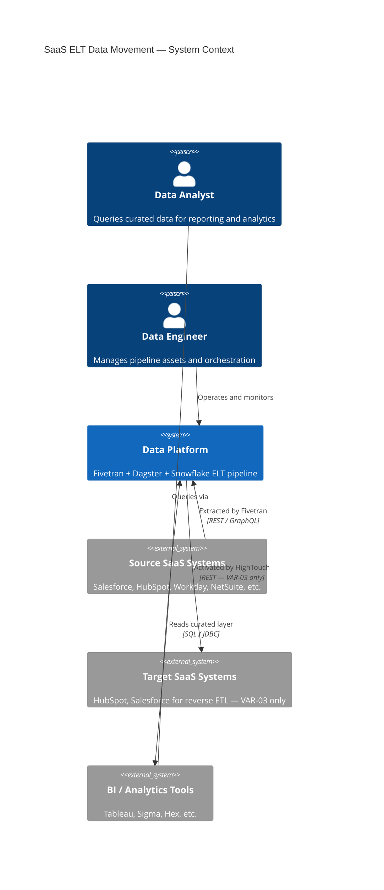
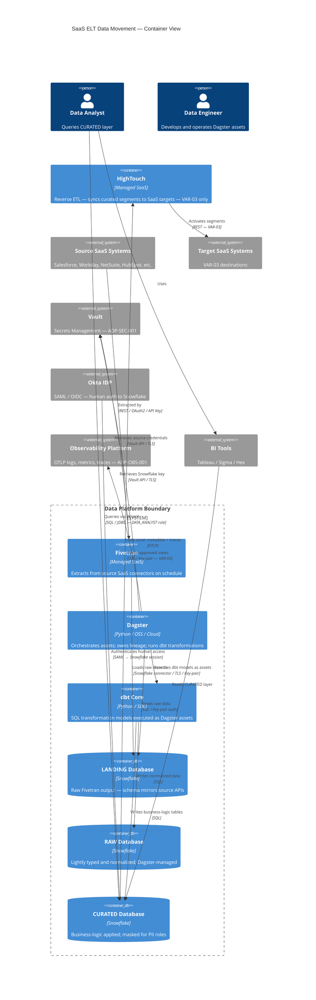
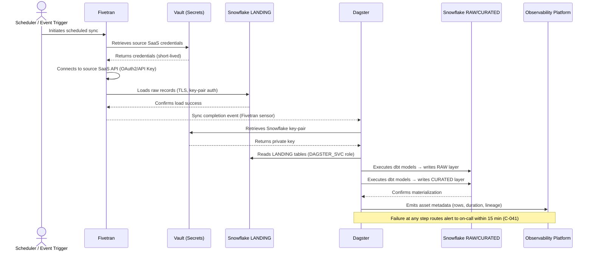

# SaaS ELT Data Movement — Fivetran + Dagster + Snowflake

> **RFC 2119 Notice:** The key words **MUST**, **MUST NOT**, **REQUIRED**, **SHALL**, **SHALL NOT**, **SHOULD**, **SHOULD NOT**, **RECOMMENDED**, **MAY**, and **OPTIONAL** in this document are to be interpreted as described in [RFC 2119](https://www.rfc-editor.org/rfc/rfc2119).

---

## 1. Pattern Identity

| Field | Value |
|---|---|
| **Pattern ID** | `ADP-DM-001` |
| **Name** | SaaS ELT Data Movement — Fivetran + Dagster + Snowflake |
| **Version** | `1.0.0` |
| **Status** | `approved` |
| **Lifecycle Stage** | `adopted` |
| **Pattern Type** | `composite` |
| **Domain** | `data-movement` |
| **Owner** | Data Platform Team |
| **Reviewers** | EA Lead, Data Architect, Security |
| **Created** | 2025-01-15 |
| **Last Reviewed** | 2025-03-01 |
| **Next Review Due** | 2025-09-01 |

---

## 2. Pattern Relationships

> This is a composite pattern. The component patterns below each have open options that have been resolved here. Any implementation team working from this pattern **MUST NOT** re-open those resolved options without a version bump and EA review.

### 2.1 Extends

| Pattern ID | Pattern Name | What Is Specialized |
|---|---|---|
| `ADP-DM-000` | Base Data Movement Pattern | Specializes to ELT (vs ETL); SaaS source systems; Snowflake as canonical destination |

### 2.2 Requires

| Pattern ID | Pattern Name | Requirement Rationale |
|---|---|---|
| `ADP-SEC-001` | Secrets Management Pattern | All credentials for Fivetran, Snowflake, and source systems must be managed via approved secrets store |
| `ADP-OBS-001` | Observability Pattern | All pipeline runs must emit to the approved observability stack |

### 2.3 Composed Of

| Pattern ID | Pattern Name | Role in This Composition | Options Resolved |
|---|---|---|---|
| `ADP-DM-010` | SaaS Ingestion Pattern | Data extraction from source SaaS systems | **Resolved:** Fivetran selected as the extraction tool (vs. custom connectors). Batch sync cadence selected (vs. streaming). |
| `ADP-DM-011` | Warehouse Landing Pattern | Raw data landing in Snowflake | **Resolved:** Raw schema isolation enforced. `LANDING` database used as canonical target for all Fivetran syncs. |
| `ADP-DM-012` | Orchestration Pattern | Pipeline scheduling, dependency management, and transformation triggering | **Resolved:** Dagster selected as orchestrator (vs. Airflow, Prefect). Software-defined assets model selected. |

### 2.4 Conflicts With

| Pattern ID | Pattern Name | Conflict Rationale |
|---|---|---|
| `ADP-DM-002` | Custom ELT (dbt Cloud + Airbyte) | These two ELT patterns **MUST NOT** be used in the same data domain. Consolidate to one pattern per domain to avoid schema conflicts and duplicated lineage. |

---

## 3. Summary

This pattern defines the approved approach for ingesting data from SaaS source systems (CRM, HRIS, billing, etc.) into the enterprise Snowflake data warehouse using Fivetran as the managed extraction layer and Dagster as the transformation orchestrator. It is the default data movement pattern for portfolio companies onboarding to the shared data platform.

The pattern separates the concerns of extraction (Fivetran), orchestration and transformation (Dagster), and warehousing (Snowflake), using a landing-raw-curated layering model. It is selected over custom connector approaches due to Fivetran's managed connector library, lower operational burden, and pre-certified compliance posture for common SaaS sources.

---

## 4. Context & Problem Statement

### 4.1 Context

Portfolio companies each carry 3–15 SaaS operational systems (Salesforce, HubSpot, NetSuite, Workday, etc.) that contain data needed for consolidated PE-level reporting and company-level analytics. Data must be reliably extracted, landed in a governed warehouse, and made available for transformation and analysis without requiring each company to build bespoke integration infrastructure.

### 4.2 Problem

How do we reliably and consistently move operational data from heterogeneous SaaS systems into a governed Snowflake environment across multiple portfolio companies, while maintaining data lineage, security controls, and operational observability — without imposing excessive engineering burden on portfolio company teams?

### 4.3 Driving Forces

- **Operational leverage:** Fivetran's managed connectors reduce connector maintenance burden to near-zero for 150+ SaaS sources.
- **Data governance:** Snowflake's RBAC and data sharing capabilities allow PE-level access without exposing raw source data.
- **Compliance:** Portfolio companies operate under varying data residency and PII handling requirements; this pattern must accommodate that variability.
- **Standardization:** Consistent tooling across portfolio companies reduces the skill-transfer cost for the shared platform team.
- **Lineage:** Dagster's software-defined assets model provides automated lineage from source through curated layer.

---

## 5. Pattern Variants

| Variant ID | Name | Status | Use When | Additional Constraints |
|---|---|---|---|---|
| `VAR-01` | Standard Batch ELT | `approved` | Source system supports Fivetran managed connector; data freshness of 1–24 hrs is acceptable | — |
| `VAR-02` | High-Frequency Batch | `approved` | Sub-hourly freshness required; source system supports high-frequency Fivetran sync | Snowflake compute cost impact **MUST** be reviewed before enabling |
| `VAR-03` | HighTouch Reverse ETL Extension | `conditionally-approved` | Curated Snowflake data must be synced back to an operational SaaS system | Requires `ADP-DM-013` (Reverse ETL Pattern) to be satisfied. PII review **MUST** be completed before activation. |

---

## 6. Acceptable Use Cases

| Use Case ID | Description | Variant | Notes |
|---|---|---|---|
| `UC-01` | Salesforce CRM → Snowflake for pipeline reporting | `VAR-01` | Standard managed connector |
| `UC-02` | HubSpot Marketing → Snowflake for multi-touch attribution | `VAR-01` | |
| `UC-03` | NetSuite ERP → Snowflake for financial consolidation | `VAR-01` | PII and Confidential data present; C-030 controls apply |
| `UC-04` | Workday HRIS → Snowflake for workforce analytics | `VAR-01` | Restricted data classification; C-030 and C-033 strictly enforced |
| `UC-05` | Snowflake curated segment → HubSpot for audience sync | `VAR-03` | HighTouch activation use case |
| `UC-06` | High-volume transactional SaaS → Snowflake with 15-min sync | `VAR-02` | Cost review required per VAR-02 constraint |

---

## 7. Unacceptable Use Cases & Anti-Patterns

| Anti-Pattern ID | Description | Why It Fails | Approved Alternative |
|---|---|---|---|
| `AP-01` | Using Fivetran to sync data between two Snowflake accounts | Fivetran is purpose-built for SaaS→warehouse; Snowflake-to-Snowflake movement incurs unnecessary cost and bypasses native sharing controls | Snowflake Data Sharing (`ADP-DM-005`) |
| `AP-02` | Writing Dagster assets that call Fivetran connectors directly via API to control sync timing | Creates tight coupling between orchestration and extraction layers; breaks the separation of concerns this pattern is built on | Fivetran triggers **MUST** remain in Fivetran scheduler or use the Dagster-Fivetran integration asset, not raw API calls |
| `AP-03` | Landing raw SaaS data directly into the `CURATED` or `ANALYTICS` schema without passing through `LANDING` | Bypasses data quality gates and breaks lineage tracking | All Fivetran syncs **MUST** target the `LANDING` database. Dagster assets promote data through layers. |
| `AP-04` | Storing Snowflake credentials in Dagster deployment environment variables unencrypted | Violates C-021; credentials are exposed in CI logs and container inspection | Credentials **MUST** be stored in the approved secrets store and injected at runtime via `ADP-SEC-001` |
| `AP-05` | Using this pattern for real-time streaming data (< 5 min latency requirements) | Fivetran batch sync cannot satisfy sub-5-minute SLAs | CDC Streaming Pattern (`ADP-DM-003`) — under development |

---

## 8. RFC 2119 Constraints

### 8.1 Implementation Constraints

| ID | Constraint | Level |
|---|---|---|
| `C-001` | All pipeline runs **MUST** be orchestrated through Dagster. No ad-hoc Fivetran syncs initiated outside of Dagster-managed schedules or sensors **SHALL** be considered part of this pattern. | MUST |
| `C-002` | Implementations **MUST** use the three-layer Snowflake schema model: `LANDING` (raw Fivetran output) → `RAW` (lightly typed, Dagster-managed) → `CURATED` (business-logic applied). | MUST |
| `C-003` | Implementations **MUST NOT** apply business transformation logic in the `LANDING` layer. | MUST NOT |
| `C-004` | Dagster asset materializations **SHOULD** be idempotent. Non-idempotent assets **MUST** be documented and approved via ADR. | SHOULD |
| `C-005` | All Dagster software-defined assets **SHOULD** declare upstream dependencies explicitly to enable automated lineage. | SHOULD |

### 8.2 Tool Constraints

| ID | Constraint | Level |
|---|---|---|
| `C-010` | The extraction tool **MUST** be Fivetran. Custom connectors or Airbyte **MUST NOT** be used within this pattern. | MUST |
| `C-011` | The orchestration tool **MUST** be Dagster (OSS or Cloud). Airflow, Prefect, and Temporal **MUST NOT** be used as the primary orchestrator for this pattern. | MUST |
| `C-012` | The destination warehouse **MUST** be Snowflake. | MUST |
| `C-013` | Where a reverse ETL use case applies (VAR-03), the activation tool **MUST** be HighTouch. Custom scripts writing back to SaaS systems **MUST NOT** be used. | MUST |
| `C-014` | Dagster **MUST** be version `>= 1.5.0`. | MUST |
| `C-015` | Fivetran connector version management **MUST** be performed through the Fivetran UI or Terraform provider. Manual API version pinning **MUST NOT** be used. | MUST |

### 8.3 Authentication & Authorization Constraints

| ID | Constraint | Level |
|---|---|---|
| `C-020` | Fivetran→Snowflake connections **MUST** authenticate using a dedicated Snowflake service account with a scoped role. The `ACCOUNTADMIN` role **MUST NOT** be used. | MUST |
| `C-021` | Snowflake credentials, Fivetran API keys, and source system credentials **MUST NOT** be stored in source code, CI environment variables, or Dagster run configuration files. They **MUST** be stored in the approved secrets store per `ADP-SEC-001`. | MUST |
| `C-022` | Human access to Snowflake **MUST** be granted through IDP group membership mapped to Snowflake roles. Direct role grants to user accounts **MUST NOT** be used. | MUST |
| `C-023` | Dagster pipeline service accounts **MUST NOT** be granted `SYSADMIN` or higher Snowflake roles. | MUST |

### 8.4 Data Constraints

| ID | Constraint | Level |
|---|---|---|
| `C-030` | Data classified as `Restricted` (e.g., HRIS, PII-containing records) **MUST NOT** be materialized in the `CURATED` layer without column-level masking policies applied in Snowflake. | MUST |
| `C-031` | All Snowflake databases used in this pattern **MUST** have Snowflake-managed encryption enabled (AES-256). | MUST |
| `C-032` | All connections (Fivetran→Snowflake, Dagster→Snowflake) **MUST** use TLS 1.2 or higher. | MUST |
| `C-033` | PII field values **MUST NOT** appear in Dagster run logs, Fivetran sync logs, or Snowflake query history in plaintext. Dynamic data masking **MUST** be applied at the Snowflake role level. | MUST |

### 8.5 Operational Constraints

| ID | Constraint | Level |
|---|---|---|
| `C-040` | All Dagster asset materializations **MUST** emit structured metadata (rows processed, duration, source connector ID) to the approved observability platform per `ADP-OBS-001`. | MUST |
| `C-041` | Fivetran sync failures **MUST** trigger a Dagster sensor that routes an alert to the on-call channel within 15 minutes of failure. | MUST |
| `C-042` | Snowflake warehouse auto-suspend **MUST** be configured to 5 minutes or less for all warehouses used exclusively by this pattern. | MUST |
| `C-043` | Dagster deployments **SHOULD** use Dagster Cloud Serverless or a Kubernetes-based deployment. Local `dagit` deployments **MUST NOT** be used in production. | MUST |

---

## 9. Tools

| Tool | Role in Pattern | Approved Version(s) | License Tier | Notes |
|---|---|---|---|---|
| **Fivetran** | Managed SaaS→Snowflake extraction | Current (managed SaaS) | Enterprise | Connector version managed by Fivetran; Terraform provider `>= 1.1` for IaC |
| **Dagster** | Orchestration, asset-based transformation scheduling, lineage | `>= 1.5.0` | OSS / Cloud | Dagster Cloud preferred for managed deployment |
| **Snowflake** | Cloud data warehouse — landing, raw, curated layers | Current (managed SaaS) | Enterprise | Dedicated warehouse per workload tier required |
| **HighTouch** | Reverse ETL — Snowflake→SaaS activation (VAR-03 only) | Current (managed SaaS) | Business / Enterprise | Required only for reverse ETL variant |
| **dbt Core** | SQL transformation within Dagster assets | `>= 1.6.0` | OSS | Used within Dagster via `dagster-dbt` integration; not standalone |
| **Terraform (Snowflake provider)** | IaC for Snowflake resource provisioning | `>= 0.87` | OSS | Required for role, database, and schema provisioning |

### 9.1 Tool Dependency Matrix

| Tool A | Version | Tool B | Version | Status |
|---|---|---|---|---|
| Dagster | `>= 1.5.0` | dagster-fivetran | `>= 0.21.0` | ✅ Approved |
| Dagster | `>= 1.5.0` | dagster-dbt | `>= 0.21.0` | ✅ Approved |
| Dagster | `< 1.5.0` | dagster-fivetran | Any | ❌ Not Approved — Violates C-014 |
| HighTouch | Any | Snowflake | Current | ✅ Approved (VAR-03 only) |

---

## 10. Authentication & Authorization

### 10.1 Identity Provider

| Attribute | Value |
|---|---|
| **IDP** | Okta (portfolio standard) |
| **Protocol** | OIDC / SAML 2.0 (for human access to Snowflake) |
| **Token Type** | SAML assertion → Snowflake session token |
| **Token Lifetime** | 1 hour (session), non-renewable without re-auth |
| **Rotation Strategy** | Snowflake key pair rotation every 90 days for service accounts |

### 10.2 Service-to-Service Authentication

| Connection | Auth Mechanism | Credential Store | Rotation Frequency |
|---|---|---|---|
| Fivetran → Snowflake | Key-pair authentication (RSA) | Fivetran credential store + Vault for private key | 90 days |
| Dagster → Snowflake | Key-pair authentication (RSA) | Vault — injected as env vars at runtime | 90 days |
| HighTouch → Snowflake | Key-pair authentication (RSA) | HighTouch credential store | 90 days |
| Fivetran → Source SaaS | OAuth2 / API Key (varies by connector) | Vault | Per-connector policy |
| Dagster → Fivetran API | API Key | Vault | 180 days |

### 10.3 RBAC Roles

| Role ID | Snowflake Role Name | Permissions | Scope | Human / Service | Notes |
|---|---|---|---|---|---|
| `R-001` | `DATA_PLATFORM_ADMIN` | Full DDL/DML, role grants | All pattern databases | Human only — Data Platform leads | IDP group-managed |
| `R-002` | `FIVETRAN_SVC` | `INSERT`, `UPDATE`, `CREATE TABLE` on `LANDING` schema only | `LANDING` database | Service | Scoped to Fivetran service account only |
| `R-003` | `DAGSTER_SVC` | `SELECT` on `LANDING`; `INSERT`, `UPDATE`, `CREATE TABLE` on `RAW` and `CURATED` | `RAW`, `CURATED` databases | Service | Used by Dagster pipeline service account |
| `R-004` | `HIGHTOCH_SVC` | `SELECT` on approved `CURATED` views only | Specific views — allowlist managed in IaC | Service | VAR-03 only. No write access to Snowflake. |
| `R-005` | `DATA_ANALYST` | `SELECT` on `CURATED` layer | `CURATED` database | Human | Granted via IDP group. Dynamic masking applied for Restricted data. |
| `R-006` | `DATA_AUDITOR` | `SELECT` on `RAW` and `CURATED` (no `LANDING`) | `RAW`, `CURATED` databases | Human | Read-only audit role. PII masking enforced. |

### 10.4 Authorization Constraints

- **[C-023]** `FIVETRAN_SVC` and `DAGSTER_SVC` **MUST NOT** be granted `SYSADMIN`, `SECURITYADMIN`, or `ACCOUNTADMIN` roles.
- **[C-024]** Human roles **MUST** be assigned via Okta group → Snowflake role mapping. Direct grants to individual Snowflake users **MUST NOT** be used.
- **[C-025]** All role assignments **MUST** be reviewed quarterly. Stale assignments flagged by Snowflake Access History **MUST** be revoked within 30 days of detection.

---

## 11. Integration Points

| Integration ID | System | Direction | Protocol | Auth Method | Data Classification | SLA | Notes |
|---|---|---|---|---|---|---|---|
| `INT-001` | Source SaaS (e.g., Salesforce) | Inbound → Fivetran | REST/GraphQL (Fivetran managed) | OAuth2 / API Key | Internal / Confidential | 99.5% sync success rate | Fivetran manages retry logic |
| `INT-002` | Snowflake `LANDING` | Outbound ← Fivetran | Snowflake connector (TLS) | Key-pair RSA | Matches source | 99.9% (Snowflake SLA) | Write-only for Fivetran role |
| `INT-003` | Snowflake `RAW`/`CURATED` | Bidirectional ← Dagster | Snowflake Python connector | Key-pair RSA | Internal / Confidential / Restricted | 99.9% | Dagster reads LANDING, writes RAW/CURATED |
| `INT-004` | Target SaaS (e.g., HubSpot) | Outbound ← HighTouch | REST (HighTouch managed) | OAuth2 | Internal (curated segments only) | 99.5% | VAR-03 only. PII review required before activation. |
| `INT-005` | Observability Platform | Outbound ← Dagster | OTLP / Webhook | API Key (Vault-managed) | Internal (metadata only) | Best effort | Run metadata, asset materialization events |
| `INT-006` | Secrets Store (Vault) | Inbound ← Dagster, Fivetran | HTTPS / Vault API | Vault AppRole | Internal | 99.9% | All credential lookups route here |

### 11.1 Integration Constraints

- **[C-070]** Fivetran connectors **MUST** have schema change handling configured to `BLOCK` for `Restricted` data sources. Auto-schema evolution **MUST NOT** be enabled for these sources.
- **[C-071]** HighTouch syncs **MUST NOT** transmit `Restricted` classified fields. The approved field allowlist **MUST** be maintained in the HighTouch model definition and reviewed at each sync activation.
- **[C-072]** Any new integration point (new SaaS source, new downstream consumer) **MUST NOT** be added without updating this pattern document and re-triggering EA review for that integration.

---

## 12. Data Flow

### 12.1 Flow Description

Source SaaS systems are connected to Fivetran via managed OAuth2 or API key credentials (stored in Vault). Fivetran syncs data on a configured cadence (typically hourly for VAR-01) into the Snowflake `LANDING` database using the `FIVETRAN_SVC` role. Landing tables are schema-identical to the source system's API output — no transformation occurs here.

Dagster monitors the `LANDING` layer via a Fivetran sensor. Upon successful sync completion, Dagster software-defined assets execute in dependency order: `LANDING` tables are lightly typed and normalized into the `RAW` layer, then business logic is applied via dbt models (executed as Dagster assets) to produce `CURATED` layer tables and views. Lineage is automatically tracked across all layers by Dagster's asset graph.

Human analysts access the `CURATED` layer exclusively via the `DATA_ANALYST` Snowflake role, which enforces dynamic data masking for `Restricted` fields. For VAR-03, HighTouch reads from approved `CURATED` views and syncs segments back to operational SaaS systems on a configurable schedule.

### 12.2 Data Classification Inventory

| Data Element | Classification | Handling Requirement |
|---|---|---|
| CRM pipeline / opportunity data | `Confidential` | Encryption at rest + in transit; no PII masking required |
| Employee records (HRIS) | `Restricted` | Column-level masking in `CURATED`; plaintext blocked at `DATA_ANALYST` role |
| Financial transaction data | `Confidential` | Encryption at rest + in transit; audit logging required |
| Marketing engagement data | `Internal` | Standard controls apply |
| Product usage telemetry | `Internal` | Standard controls apply |
| Customer PII (name, email, phone) | `Restricted` | Dynamic masking at Snowflake role level; MUST NOT appear in logs |

### 12.3 Data Flow Constraints

- **[C-030]** `Restricted` data **MUST NOT** be available in unmasked form to any role below `DATA_PLATFORM_ADMIN`.
- **[C-031]** All Snowflake databases **MUST** use Snowflake-managed AES-256 encryption.
- **[C-032]** All connections **MUST** use TLS 1.2+.
- **[C-033]** PII values **MUST NOT** appear in Dagster logs, Fivetran sync logs, or Snowflake query history.

---

## 13. Architecture Diagrams

### 13.1 Lite View — System Context (C4 Level 1)

> Use for executive summaries and pattern catalogue entries.



### 13.2 Full View — Container Diagram (C4 Level 2)

> Use for architecture review sessions and implementation guidance.



### 13.3 Data Flow Sequence



---

## 14. Application Lifecycle Integration

| ALM Stage | Applicability | Required Actions | Gate Owner |
|---|---|---|---|
| **Inception** | Required evaluation | Confirm source SaaS system has an approved Fivetran connector; document selected variant (VAR-01/02/03) in solution brief | EA Team |
| **Design** | Required reference | Cite `ADP-DM-001` in solution design; document all integration points for §11; complete data classification inventory for §12 | Solution Architect |
| **Build** | CI gate | Pattern linter validates Snowflake role names, Fivetran connector config, and Dagster asset metadata emission before merge | Automated + Data Platform |
| **Release** | Architecture sign-off | First production activation for each portfolio company requires EA and Data Platform sign-off | EA Lead |
| **Operate** | Continuous | Drift detection active; Fivetran sync SLA monitored; Snowflake cost anomaly detection enabled | Platform / EA |
| **Retire** | Migration required | If retiring a source connector, migration plan to alternative source or deprecation of downstream assets **MUST** be documented | Data Engineer + EA |

---

## 15. Drift Detection Specification

```yaml
drift_detection:
  pattern_id: ADP-DM-001
  pattern_version: "1.0.0"
  last_updated: "2025-03-01"

  assertions:

    - id: DA-C010
      constraint_ref: C-010
      description: "Extraction tool must be Fivetran — no other connectors permitted"
      severity: critical
      detection_method: config_scan
      target:
        resource_type: fivetran_connector
        attribute: "service"
        expected_value: "fivetran"
        operator: exists
      remediation: "Remove unapproved connector and replace with Fivetran managed connector"
      autoremediable: false

    - id: DA-C011
      constraint_ref: C-011
      description: "Dagster must be the sole orchestrator — no Airflow or Prefect deployments"
      severity: critical
      detection_method: iac_scan
      target:
        resource_type: k8s_deployment
        attribute: "labels.orchestrator"
        expected_value: ["airflow", "prefect"]
        operator: not_exists
      remediation: "Decommission non-Dagster orchestrator and migrate jobs to Dagster assets"
      autoremediable: false

    - id: DA-C002
      constraint_ref: C-002
      description: "Three-layer Snowflake schema model must exist (LANDING, RAW, CURATED)"
      severity: high
      detection_method: api_poll
      target:
        resource_type: snowflake_database
        attribute: "name"
        expected_value: ["LANDING", "RAW", "CURATED"]
        operator: contains
      remediation: "Provision missing Snowflake databases via approved Terraform module"
      autoremediable: false

    - id: DA-C020
      constraint_ref: C-020
      description: "ACCOUNTADMIN role must not be assigned to Fivetran or Dagster service accounts"
      severity: critical
      detection_method: api_poll
      target:
        resource_type: snowflake_role_grant
        attribute: "role"
        expected_value: "ACCOUNTADMIN"
        operator: not_exists
      remediation: "Revoke ACCOUNTADMIN from service accounts immediately. Reassign scoped roles per §10.3."
      autoremediable: false

    - id: DA-C021
      constraint_ref: C-021
      description: "No Snowflake credentials in environment variables or source code"
      severity: critical
      detection_method: iac_scan
      target:
        resource_type: k8s_secret
        attribute: "data.SNOWFLAKE_PASSWORD"
        expected_value: ""
        operator: not_exists
      remediation: "Remove credential from environment. Migrate to Vault-backed secret injection per ADP-SEC-001."
      autoremediable: false

    - id: DA-C031
      constraint_ref: C-031
      description: "Snowflake databases must use managed encryption"
      severity: critical
      detection_method: iac_scan
      target:
        resource_type: snowflake_database
        attribute: "data_retention_time_in_days"
        expected_value: 1
        operator: gte
      remediation: "Enable Snowflake Tri-Secret Secure or managed encryption. Contact Data Platform team."
      autoremediable: false

    - id: DA-C041
      constraint_ref: C-041
      description: "Fivetran sync failure alerting must be configured in Dagster"
      severity: high
      detection_method: config_scan
      target:
        resource_type: dagster_sensor
        attribute: "sensor_type"
        expected_value: "fivetran_sync_failure_sensor"
        operator: exists
      remediation: "Add Fivetran failure sensor to Dagster code location per the platform runbook"
      autoremediable: false

    - id: DA-C042
      constraint_ref: C-042
      description: "Snowflake warehouse auto-suspend must be <= 5 minutes"
      severity: medium
      detection_method: api_poll
      target:
        resource_type: snowflake_warehouse
        attribute: "auto_suspend"
        expected_value: 300
        operator: lte
      remediation: "Set AUTO_SUSPEND = 300 on all pattern warehouses via Terraform"
      autoremediable: true

  composition_checks:
    required_patterns:
      - pattern_id: ADP-SEC-001
        min_version: "1.0.0"
        check: "Secrets management pattern must be deployed and compliant"
      - pattern_id: ADP-OBS-001
        min_version: "1.0.0"
        check: "Observability pattern must be deployed and compliant"

  notification:
    on_drift_detected:
      - type: slack
        target: "#data-platform-alerts"
      - type: jira
        project: "ARCH"
        issue_type: "Architecture Drift"
        priority_map:
          critical: P1
          high: P2
          medium: P3
          low: P4

  exemption:
    requires_approvers:
      - "EA Lead"
      - "CISO (for C-020, C-021, C-031 violations)"
    max_duration_days: 90
    tracking: "Must reference an approved ADR number"
    review_cadence_days: 30
```

---

## 16. Review & Approval

### 16.1 Review History

| Date | Reviewer | Version | Outcome | Notes |
|---|---|---|---|---|
| 2025-01-20 | Data Architect | `0.1.0` | Deferred | Requested addition of HighTouch variant and reverse ETL anti-patterns |
| 2025-02-10 | Data Architect, Security | `0.2.0` | Approved | VAR-03 added; security constraints tightened |
| 2025-03-01 | EA Lead | `1.0.0` | Approved | Promoted to `adopted` lifecycle stage |

### 16.2 Approval Sign-Off

| Role | Name | Date | Reference |
|---|---|---|---|
| **EA Lead** | _[EA Lead Name]_ | 2025-03-01 | |
| **Data Architect** | _[Architect Name]_ | 2025-02-10 | |
| **Security Review** | _[Security Lead]_ | 2025-02-10 | |

### 16.3 Open Issues

| Issue ID | Description | Owner | Target Date | Blocking? |
|---|---|---|---|---|
| `OI-001` | CDC Streaming pattern (ADP-DM-003) not yet ratified — AP-05 references it as an alternative | Data Platform | 2025-06-01 | No |
| `OI-002` | HighTouch PII review checklist not yet standardized | Security | 2025-04-15 | No (VAR-03 conditionally approved in meantime) |

---

## 17. References

| Type | ID | Title |
|---|---|---|
| Pattern | `ADP-DM-000` | Base Data Movement Pattern |
| Pattern | `ADP-SEC-001` | Secrets Management Pattern |
| Pattern | `ADP-OBS-001` | Observability Pattern |
| Pattern | `ADP-DM-005` | Snowflake Data Sharing Pattern |
| Pattern | `ADP-DM-013` | Reverse ETL Pattern |
| Standard | `STD-DATA-001` | Snowflake Schema Naming Conventions |
| External | — | [RFC 2119](https://www.rfc-editor.org/rfc/rfc2119) |
| External | — | [C4 Model](https://c4model.com) |
| External | — | [Dagster Software-Defined Assets](https://docs.dagster.io/concepts/assets/software-defined-assets) |

---

## 18. Changelog

| Version | Date | Author | Changes |
|---|---|---|---|
| `0.1.0` | 2025-01-15 | Data Architect | Initial draft |
| `0.2.0` | 2025-02-05 | Data Architect | Added VAR-03 (HighTouch), tightened auth constraints, added anti-patterns AP-04/AP-05 |
| `1.0.0` | 2025-03-01 | EA Lead | Promoted to approved/adopted; finalized drift detection assertions |

---

_Pattern template version: 1.0.0 — Maintained by the Enterprise Architecture team._
